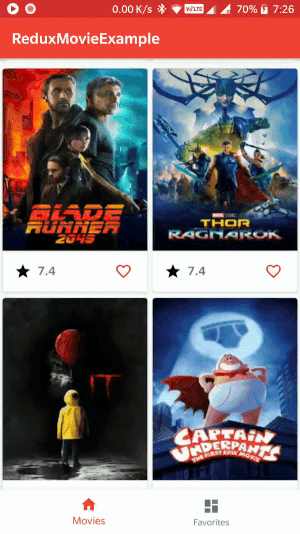

# Redux Movie Application

A sample application implementing redux to display list of movies from
an API and allow storing of favorite movies. Built with [ReKotlin](https://github.com/ReKotlin/ReKotlin)



# Basics

### State
An immutable entity with consists data about your screen/app. Application
can have multiple states which form a tree structure to create a global app
state.

Example
```kotlin
// Global State
data class AppState(
        var movieListState: MovieListState? = null,
        var favoriteCounterState: FavoriteCounterState? = null,
        var favoriteListState: FavoriteListState? = null
) : StateType
```

State implement ```StateType``` and Kotlin's ```data class``` is used
to leverage ```copy()``` function for maintaining immutability.

### Store
Store is a collection of states, reducers and middlewares. It is also used
to dispatch Actions.

Example
```kotlin
// Initializing store.
// appReducer is collection of all reducers and state represents AppState
val store = Store(
        reducer = ::appReducer,
        state = null,
        middleware = listOf(networkMiddleWare, databaseMiddleWare, movieMiddleWare)
)

// Dispatching an action
store.dispatch(Increment())
```

### Actions
Actions defines an intent to do something. Action can be anything
ranging from getting initial list of movies from server to incrementing
a counter in bottom tab bar.

Actions are the only way to produce a new state and can carry optional
payload.

Example
```kotlin
// Action for displaying list of movies taking a list parameter
class DisplayMovies(val movieObjects: List<MovieObject>) : Action

// Simple action to increment favorite counter
class Increment : Action

// Action to set initial count of favorites during app launch
class SetInitialCount(val count: Int) : Action
```

### Reducers
Reducers are called whenever an Action is dispatched. A reducer will
return a new immutable state depending on Action dispatched.

Reducers are pure functions which makes testing them easier.

Example
```kotlin
fun favoriteCounterReducer(action: Action, favoriteCounterState: FavoriteCounterState?)
        : FavoriteCounterState {
    var state = favoriteCounterState ?: FavoriteCounterState()
    when (action) {
        is SetInitialCount -> {
            // New immutable state
            state = state.copy(favoriteCount = action.count)
        }
        is Increment -> {
            state = state.copy(favoriteCount = state.favoriteCount + 1)
        }
        is Decrement -> {
            state = state.copy(favoriteCount = state.favoriteCount - 1)
        }
    }
    return state
}
```

Kotlin's when closure help in inference of Action classes more declarative
manner using ```is``` rather than check of ```instance of <Class>``` typically
done in Java.

### Middleware
Middleware(s) is an optional concept. They can be used to perform long
running operations which may not be ideal for Reducers. Middleware can
dispatch a State for Reducer to consume.

Middleware is also called by dispatching an action similar to Reducer.

Example
```kotlin
internal val networkMiddleWare: Middleware<AppState> = { dispatch, getState ->
    { next ->
        { action ->
            when (action) {
                // Check for Action
                is LoadTopRatedMovies -> {
                    callTopRatedMovies(dispatch)
                }
            }
            next(action)
        }
    }
}

private fun callTopRatedMovies(dispatch: DispatchFunction) {
    val apiService = ApiClient.client?.create(ApiInterface::class.java)
    val call = apiService?.discoverMovies(API_KEY)

    call?.enqueue(object : Callback<MovieResponse> {
        override fun onFailure(call: Call<MovieResponse>?, t: Throwable?) {
            Timber.e(t)
        }

        override fun onResponse(call: Call<MovieResponse>?, response: Response<MovieResponse>?) {
            val movieObjects = response?.body()?.results
            movieObjects?.let {
                // Dispatch Action for Reducer
                dispatch(InitializeMovieList(it))
            }
        }
    })
}
```

### Usage
UI classes can implement ```StoreSubscriber<State>``` and receive an
override method to get new states.

```kotlin
class MainActivity : AppCompatActivity(), StoreSubscriber<FavoriteCounterState?> {

    // Subscribe specific state from store
    override fun onStart() {
        super.onStart()
        store.subscribe(this) {
            it.select {
                it.favoriteCounterState
            }
        }
    }

    // Unsubscribe from store
    override fun onStop() {
        super.onStop()
        store.unsubscribe(this)
    }

    // Receive new state whenever it is modified.
    override fun newState(state: FavoriteCounterState?) {
        state?.apply {
            if (favoriteCount != 0) {
                favoriteTab.setBadgeCount(favoriteCount)
            }
        }
    }
```

# Running Project
- Import in Android Studio.
- Get API key from [here](https://developers.themoviedb.org/3/getting-started/introduction)
and update in Api.kt
- Run the project